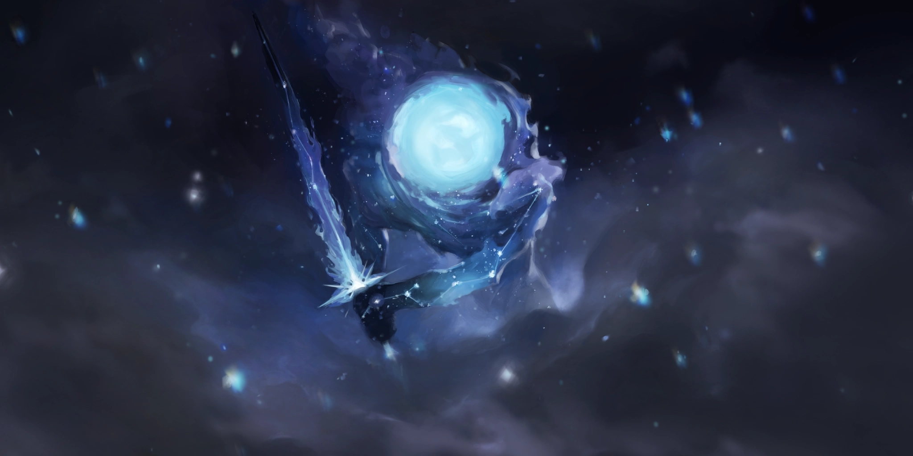
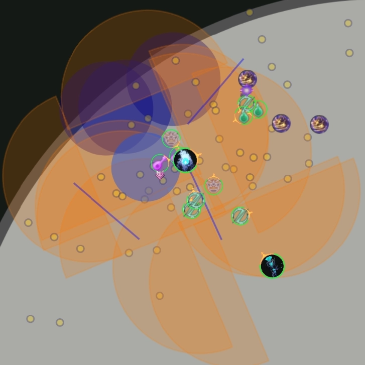
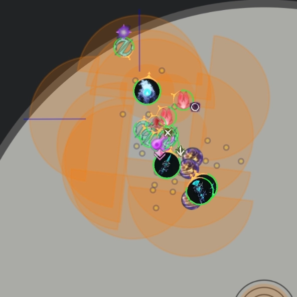
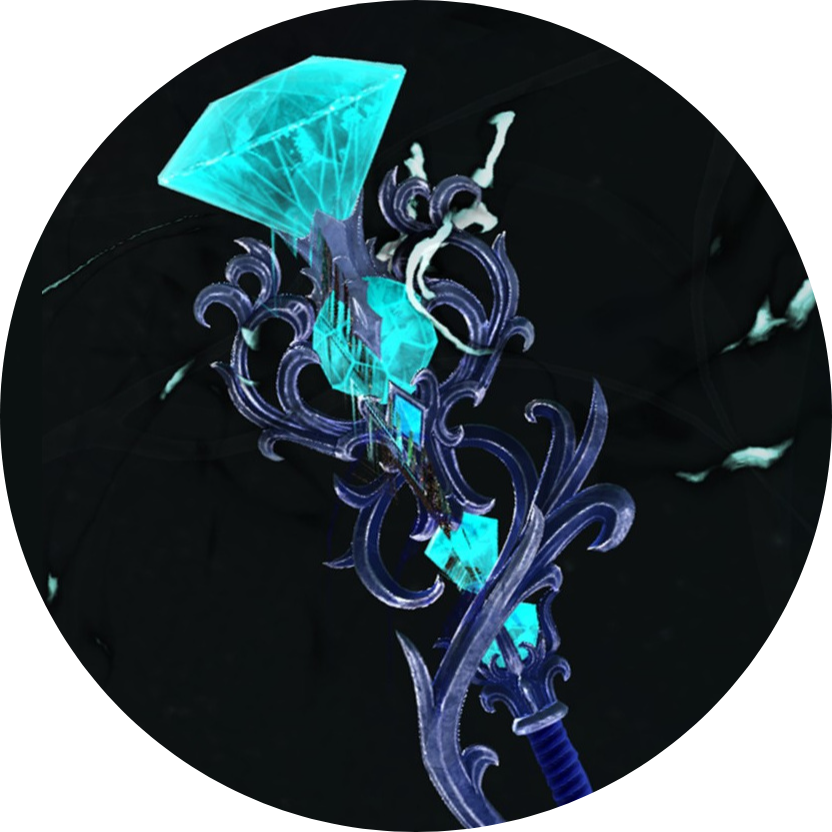
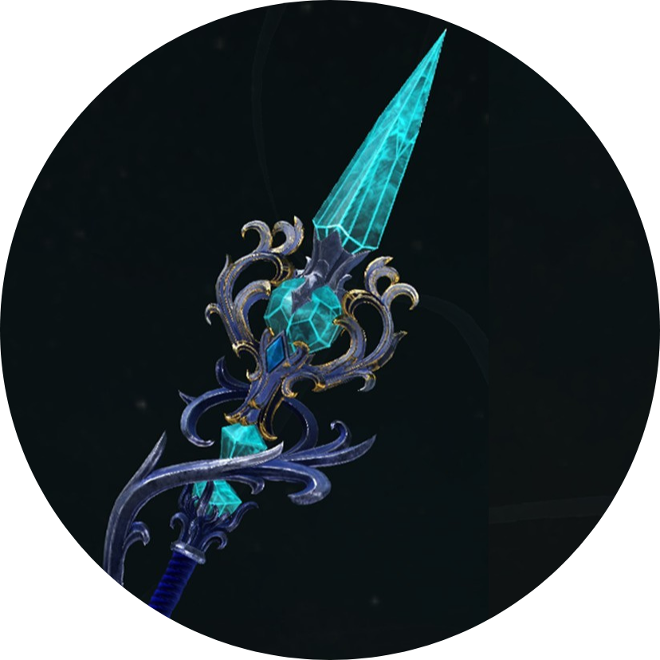
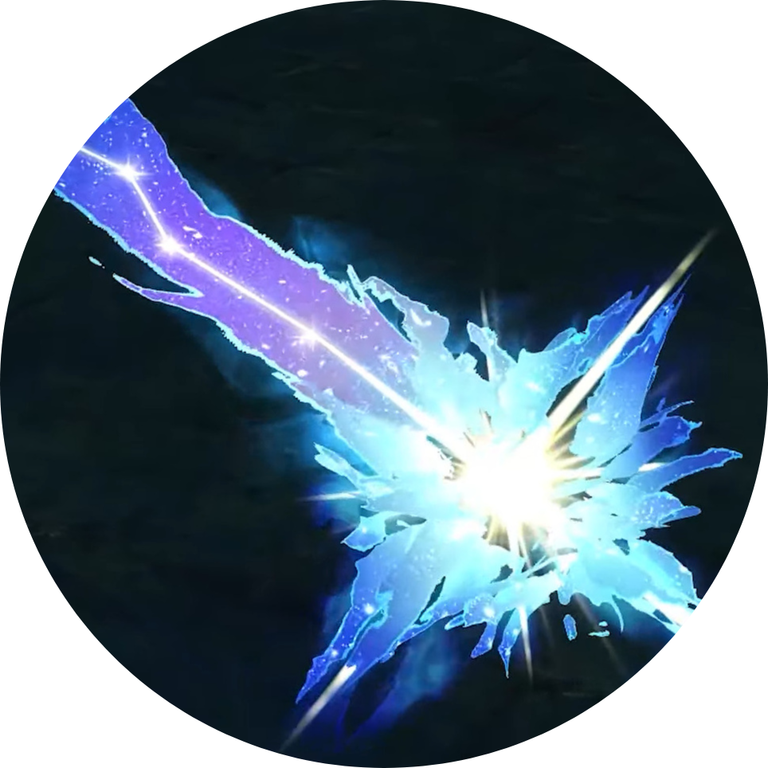
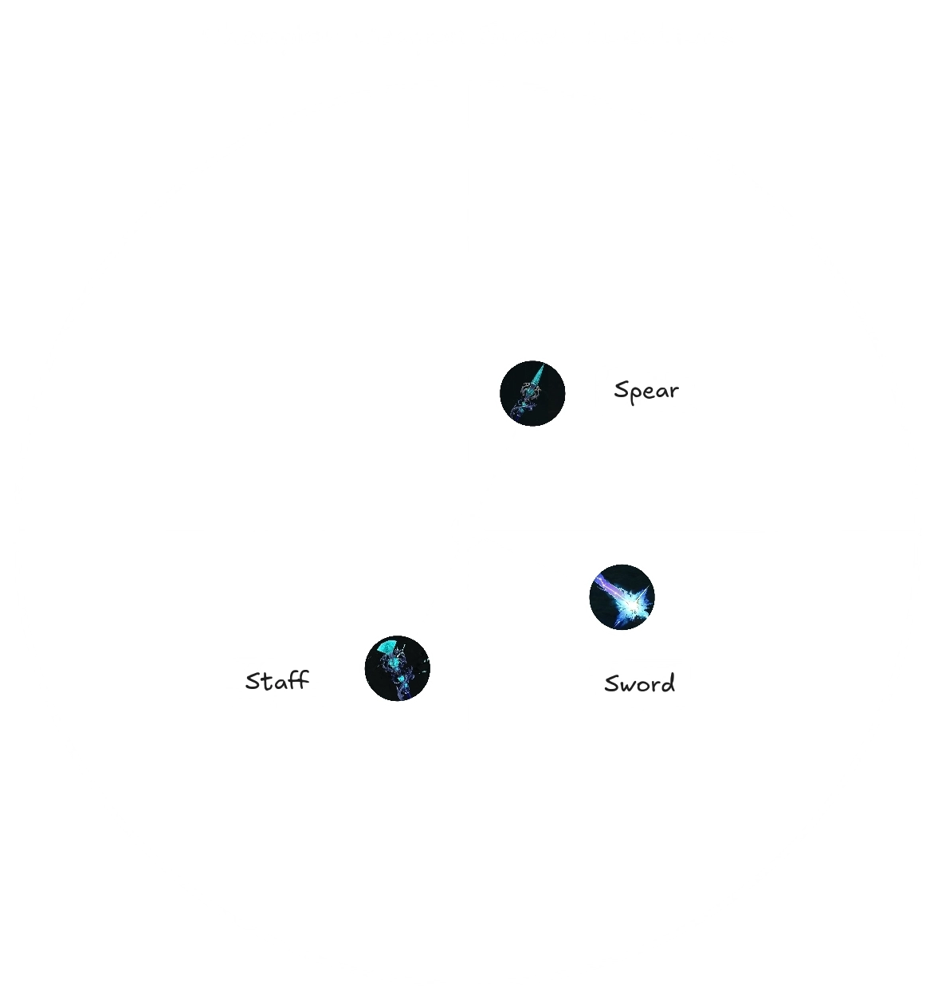
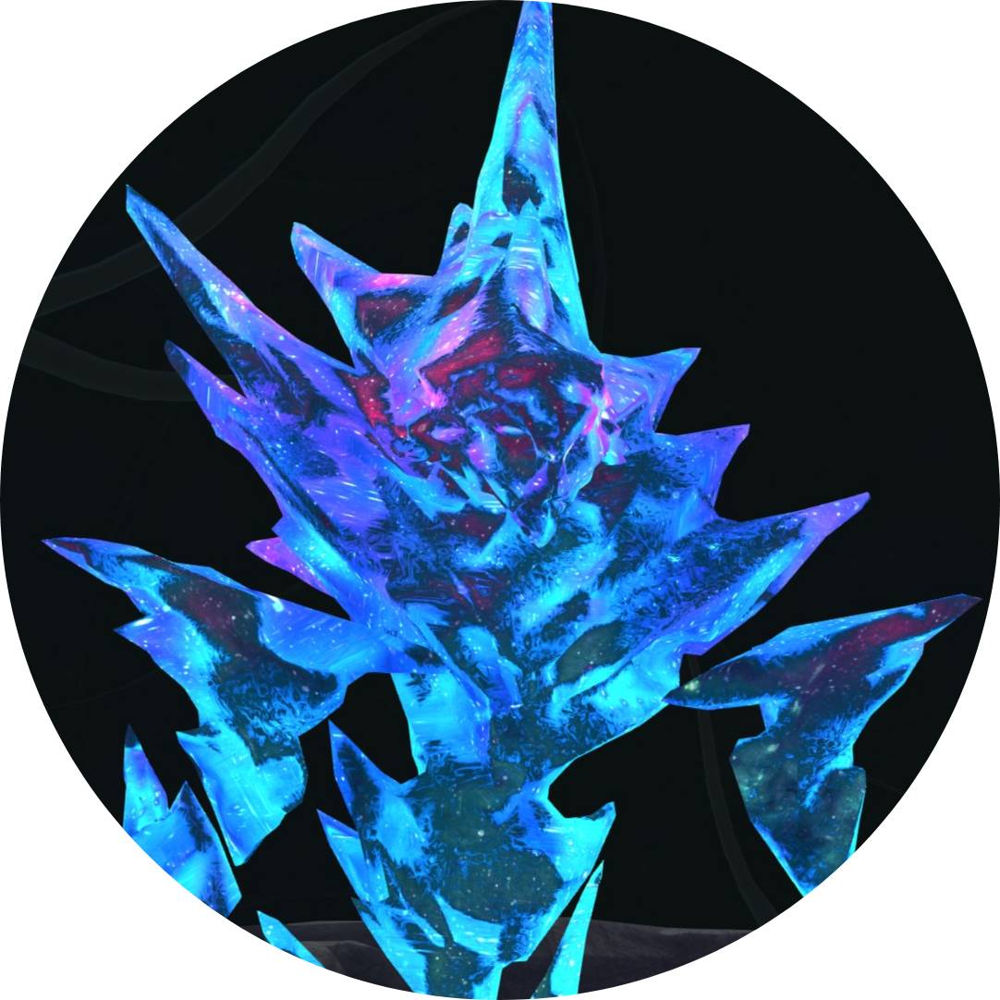
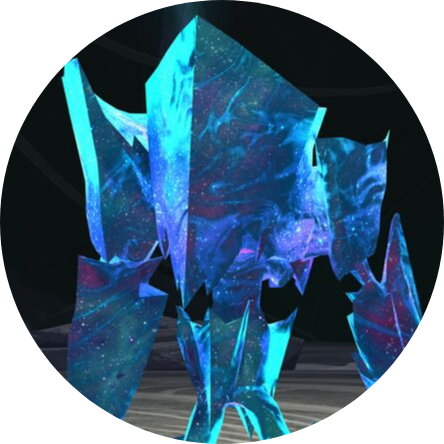
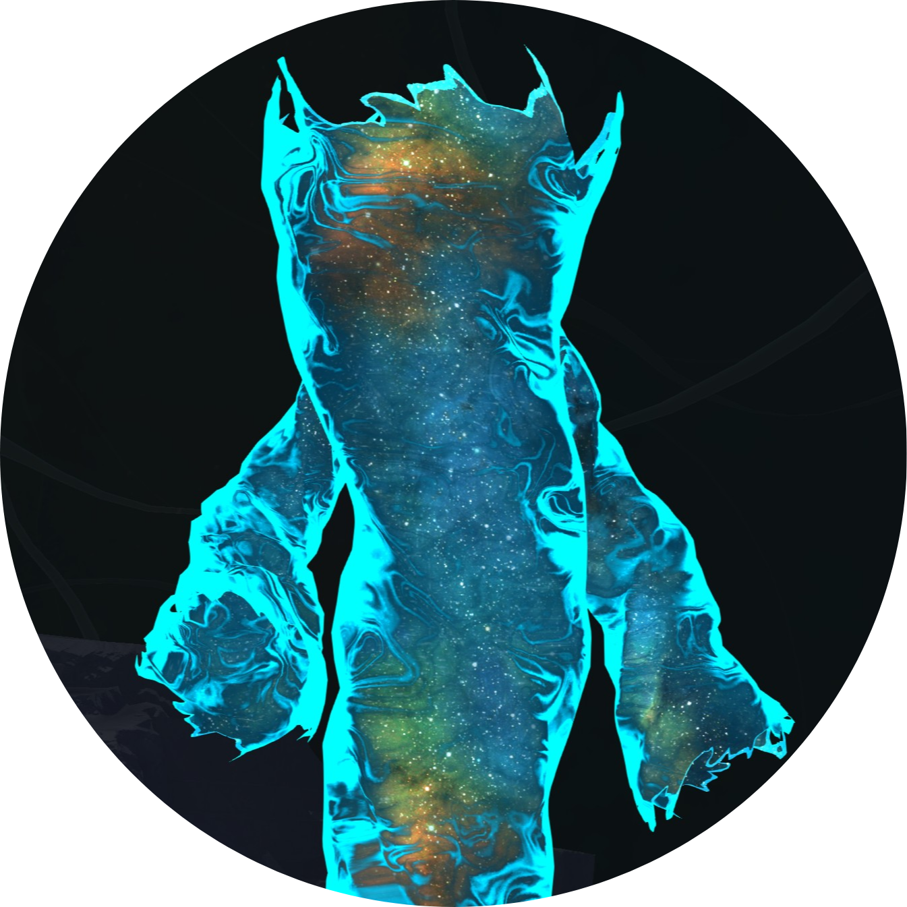

[Return to Home](../index.html){: .btn}

# Mechanical Reference
{: .no_toc .center}

| **Health** |  84,939,840  |
| **Defiance Bar** | 6000 |
| **Armor** | 2597 (standard) |
| **Hitbox** | 180 (medium) |
| **Enrage** |  10 minutes, kills everyone on running out. |

This page contains a detailed reference of the various attacks and mechanics present in the encounter.

<b>Table of Contents</b>

1. TOC
{:toc}

---

## Fight Structure

The battle against Vloxx is divided into three main phases, three split phases and a final phase.

---

### Main Phases

Vloxx's main phases are styled around his three weapons: *Staff*, *Spear* and *Sword*. Each main phase is mostly limited to a set of mechanics specific to the phase's weapon, plus a few attacks that are present in all three.

Vloxx's behaviour in the main phases is based on a priority-cooldown system:
- All active mechanics have their own *cooldown* and *priority*.
- The boss will always cast the highest priority skill that is off-cooldown.

While this is similar in concept to bosses such as [Greer](https://silverhalf.github.io/mount-balrior/greer/overview.html) and [Ura](https://silverhalf.github.io/mount-balrior/ura/overview.html), in practice Vloxx's relatively short cooldowns and absence of skill interruptions means the boss will usually present the same order of mechanics consistently for each phase.

#### 100% - 70% - Staff Phase

Vloxx's staff is modeled after [Ancora Pax](https://wiki.guildwars2.com/wiki/Ancora_Pax). This phase is characterized by a large amount of projectiles: reflecting or blocking these can be potentially dangerous since some will bounce off, resulting in several potentially dangerous AoEs.

*Weapon Skills:* [Annihilating Orb], [Ascension's Sacrifice], [Eternal Reflection], [Surrounding Curse]

#### 70% - 40% - Spear Phase

Vloxx's spear is modeled after [Ancora Bellum](https://wiki.guildwars2.com/wiki/Ancora_Bellum). This phase is mostly characterized by [Worldpiercer] heavily limiting squad movement while [Raging Storm] requires either permanent projectile block or constant repositioning.

*Weapon Skills:* [Cosmic Charge], [Raging Storm], [Thousand Strikes], [Worldpiercer]

#### 40% - 10% - Sword Phase

Vloxx's sword is modeled after [Wages of Stars](https://wiki.guildwars2.com/wiki/Wages_of_Stars). This phase is characterized by a large amount of AoE Damage, especially from [Echoing Blade] and [Excision Extremis]. This requires a lot of attention from the group to either out-heal or avoid most of the danger.

*Weapon Skills:* [Division Eternal], [Echoing Blade], [Excision Extremis], [Slice Through Reality]

---

### Split Phases

Each split phase starts with Vloxx teleporting to the center of the arena and gaining  [Defensive Inspiration](). An enemy champion will them spawn, along with two elites. The type of enemy depends on the phase:
- 70% - [Cosmic Piercer](#split-phase-enemies) champion and elites.
- 40% - [Cosmic Bulwark](#split-phase-enemies) champion, [Cosmic Piercer](#split-phase-enemies) elites.
- 10% - [Cosmic Sunderer](#split-phase-enemies) champion, [Cosmic Piercer](#split-phase-enemies) and [Cosmic Bulwark](#split-phase-enemies) elites.

Killing all three enemies unlocks Vloxx's  [Defiance Bar], allowing the squad to break it and continue into the following phase.

---

### Final Phase

At the beginning of this phase, Vloxx will transition into his final form. He will then cast [Threshold of Eternity], which kills all players 2 minutes after the beginning of the phase. During this cast, Vloxx will constantly cycle through the same set of skills ad infinitum:
1. [Judgement of Eternity] (Greens)
2. [Surrounding Curse] (Small AoEs)
3. [Excision Extremis] (Swords)
4. [Probability Distribution] (Puddles)
5. [Raging Storm] (Spears)
6. [Excision Extremis] (Swords)

This makes for a challenging phase, since incoming damage and mechanical pressure are extremely high up until the boss dies.

## General Mechanics

These mechanics are present for the entirety of the fight independent of the phase.

|**Mechanic**|**Common Name**|**Brief Description**|
|  [Empowered] | Stacks | Buff applied to Vloxx on failed mechanics. |
|  [Ascension] | Stacks | Buff applied to players to counteract  [Empowered]. |
|  [Fixate] | Tank | Randomly selects a player to become the target for Vloxx's attacks. |
| [Judgement of Eternity] | Greens | Three greens requiring three people each. |
| [Probability Distribution] | Pools | Three large AoEs that leave lingering pools. |

---

###  Empowered

 [Empowered] is an effect granted to Vloxx by several sources over the course of the encounter. Each stack grants him 5% increased outgoing damage and 1% reduced incoming damage, stacking additively. Additionally, Vloxx starts gaining boons at certain stack thresholds:
- At 5  stacks, he periodically gains  [Might].
- At 15  stacks, he periodically gains 25  [Might].
- At 50  stacks, he periodically gains  [Resolution].
- At 75  stacks, he periodically gains  [Protection].

Vloxx can gain  [Empowered] in three ways:
- [Champion Weapons](#weapons) will grant him one  stack 24 seconds after spawning and one additional  stack at 20 second intervals following.
- [Visions of Eternity] will grant him 10  stacks when he either completes the cast or his  [Defiance Bar] is broken.
- Whenever a player loses one or more stacks of  [Ascension], Vloxx will gain an equivalent number of  [Empowered].

{: .note}
This counts dead players as well, since they "lose" 10  stacks on dying. Vloxx will therefore gain 10  [Empowered] for each dead player.

Additionally, whenever a player gains a stack of  [Ascension], Vloxx will *lose* a stack of  [Empowered].

---

###  Ascension

 [Ascension] is a player buff that is diametrically opposed to  [Empowered]. All players will begin the encounter with 10  stacks, and will immediately die if they ever reach zero.

Players *lose*  stacks whenever they fail certain mechanics:
- [Judgement of Eternity] - every player inside a green when it fails loses 3  stacks.
- [Ascension's Sacrifice] - if a chain fails, the chained player loses a  stack.
- [Slice Through Reality] - every player that is dragged into the teleport area after it spawns loses a  stack.

Whenever a player loses  stacks, Vloxx will gain the same number of  [Empowered].

Players will *gain*  stacks whenever they pick up *orbs*. Three of these drop from [Champion Weapons](#weapons) whenever their  [Defiance Bar] is broken.

---

###  Fixate

This effect is applied to a random player in Vloxx's cone of vision. If no one is in sight, it will select the closest person instead. This player will hear an audio cue and gain an  icon over their head showing the effect. They will then become the primary target for most of Vloxx's skills.

The effect lasts for 60 seconds, and is re-assigned 10 seconds after running out.

---

### Judgement of Eternity

Targets the  [Fixated] player and the two closest non-fixated players with a green, requiring three people inside. Failing to solve a green deals moderate damage, applies  [Burning],  [Chilled] and  [Float], and removes three stacks of  [Ascension] from all players in its area.

Players standing in multiple greens will go  [Downstate]. This cannot be prevented by damage immunity or invulnerability effects such as  [We Will Never Yield!] or  [Tale of the August Queen], unlike other similar mechanics.

Greens have a maximum range of 3000 units. The number of greens in this mechanic depends on the number of living players: with less players alive, fewer greens will spawn so that the mechanic is always solvable.

---

### Probability Distribution

Targets the  [Fixate] and two additional random players with large tracking AoEs. After following their targets for five seconds, they will become stationary and explode three second later, dealing moderate damage and inflicting  [Knockback] and  [Poison] to any players in the area and turning into stationary pools.

These pools persist for two pulse damage and inflict  [Crippled].

AoEs can and should be stacked together to save space.

## Staff Attacks

These attacks can be used by Vloxx during the first phase or the final phase, or by the [Champion Staff].

|**Mechanic**|**Common Name**|**Brief Description**|
| [Annihilating Orb] | Orb, Teleport | Launches a massive orb in a line, then teleports to its final location. |
| [Ascension's Sacrifice] | Chains | Targets players with chains that require a friend. |
| [Eternal Reflection] | Cone, Barrage | Launches a barrage of exploding projectiles in a cone. |
| [Surrounding Curse] | Small AoEs | Summons a rain of projectiles on the group. |

---

### Annihilating Orb

Launches a massive orb towards the  [Fixated] player, indicating the direction with a large arrow. The orb inflicts  [Slow],  [Burning] and  [Knockback] to players in its area. Once it reaches its maximum range of 1500 units, Vloxx teleports to it, unleashing a shockwave that deals damage and inflicts  [Knockback].

After teleporting, Vloxx will maintain an aura for a few seconds that continues to  [Knockback] and  [Slow] players.

---

### Ascension's Sacrifice

Three players, including the  [Fixate], will get targeted by chains. These  [Float] and push away the chained player, summoning a small green below them that requires two player to solve. Failing to solve a green will  [Float] the chained player a second time and remove a stack of  [Ascension] from them.

Players standing in multiple greens will go  [Downstate]. This cannot be prevented by damage immunity or invulnerability effects such as  [We Will Never Yield!] or  [Tale of the August Queen], unlike other similar mechanics.

---

### Eternal Reflection

Launches a barrage of projectiles in a wide cone towards the  [Fixate], dealing heavy damage.

These projectiles bounce and explode whenever they interact with projectile destruction or reflection effects such as  [Feedback] or  [Corrosive Poison Cloud], dealing heavy damage in proximity of the effect.

---

### Surrounding Curse

Summons a rain of small projectiles on the  [Fixate] that explode, dealing light damage and inflicting  [Torment] and  [Weakness].

{: .note}
While this attack can technically be reflected, it will often overlap with [Eternal Reflection], which makes it dangerous to do so.

## Spear Attacks

These attacks can be used by Vloxx during the second phase or the final phase, or by the [Champion Spear].

|**Mechanic**|**Common Name**|**Brief Description**|
| [Cosmic Charge] | Charge | Charges in a line, leaving damaging pools on its trail. |
| [Raging Storm] | Spears | Launches a barrage of spears that  [Knockback] and leave lingering pools. |
| [Thousand Strikes] | Cone | Launches a barrage of spear thrusts in a cone. |
| [Worldpiercer] | Walls, Lines | Six walls divide the arena into six slices. |

---

### Cosmic Charge

Targets the  [Fixate] with a large orange arrow. After a brief pause, charges forward for 1500 units, dealing moderate damage, inflicting  [Knockback] and leaving behind a trail of lingering puddles. These corrupt boons and inflict  [Crippled] and  [Burning].

---

### Raging Storm

Targets the  [Fixate] with a barrage of 16 spears at 1 second intervals. Each spear explodes in a small AoE on hitting the floor, dealing moderate damage, inflicting  [Knockback] and leaving behind a lingering puddle. This puddle deals moderate damage and strips boons.

Spears are projectiles and thus affected by projectile disruption.

---

### Thousand Strikes

Vloxx attacks with a series of strikes in a cone, dealing heavy damage.

---

### Worldpiercer

Vloxx summons six red arrows in a star, which fire after a delay,  [Downstating] any player caught in one and killing any player caught in two.

The arrows then leave behind narrow walls that inflict  [Knockback] and 10 stacks of  [Burning] on any players that attempt to walk through their area. It is possible to dodge through these, or walk through with  [Stability] while cleansing the conditions.

Walls persist for 30 seconds, and are not removed on changing phase.

## Sword Attacks

These attacks can be used by Vloxx during the third phase or the final phase, or by the [Champion Sword].

|**Mechanic**|**Common Name**|**Brief Description**|
| [Division Eternal] | Rectangle | Large rectangular damaging AoE. |
| [Echoing Blade] | Circle | Circular attack that launches rotating sword projectiles. |
| [Excision Extremis] | Blades, Storm | Large amount of overlapping semicircular AoE damage and boonstrip. |
| [Slice Through Reality] | Teleport, Suction | Teleport skill that leaves a rift that sucks in players. |

---

### Division Eternal

Targets the  [Fixate] with a large rectangular AoE that inflicts high damage, strips boons and applies  [Blinded] and  [Confusion].

---

### Echoing Blade

Circular attack composed of several semicircular AoE slices centered around the boss, combined with red rotating sword projectiles. While each slice deals moderate damage, the cumulative damage from multiple hits can quickly become threatening. The sword projectiles apply moderate damage and inflict  [Torment] and  [Weakness], and can be deleted using standard projectile disruption.

---

### Excision Extremis

Large area attack composed of a storm of overlapping, small to medium sized semicircular sword AoE attacks. Each of these deals moderate damage, inflicts  [Crippled] and  [Bleeding], and strips boons with an internal cooldown of 2 seconds.

#### Excision Extremis Patterns
{: .no_toc .center}

While individual AoEs are not dangerous, the cumulative damage from multiple hits can quickly become threatening. This attack occurs in multiple instances with several different patterns. The boss will select which pattern to use based on the phase (3rd or 4th) and the distance of the  [Fixate].

---

### Slice Through Reality

Vloxx slices through space, opening up a rift that transports him to a different location, 1500 units in the direction of the  [Fixate]. Any players inside of Vloxx's hitbox will be transported with him. 

The entrance of the rift sucks in players, while the exit pushes them away. Players sucked into the rift will be transported to Vloxx's new location, get  [Knockdown], have three boons corrupted and lose a stack of  [Ascension]. This does not apply to players that were transported with Vloxx's initial teleportation.

## Special Attacks

### Visions of Eternity

### Threshold of Eternity

## Enemies

The Nexus of Eternity encounter is characterized by a large amount of enemy adds that enter the picture at different points in the encounter. These can mostly be divided into two groups: *split phase adds* and *weapon adds*.

---

### Weapons

These are three Champion Weapons, one for each of Vloxx's weapons:

#### Aspect of the Staff
{: .no_toc}

Spawns at the beginning of the fight. Can use the skills: [Eternal Reflection], [Surrounding Curse].

#### Aspect of the Spear
{: .no_toc}

Spawns at the beginning of the first split phase (70%). Can use the skills: [Cosmic Charge], [Thousand Strikes].

#### Aspect of the Sword
{: .no_toc}

Spawns at the beginning of the second split phase (40%). Can use the skills: [Division Eternal], [Excision Extremis].

#### Champion Weapon
{: .no_toc .center}

| **Health** |  4,620,570  |
| **Defiance Bar** | 1000 |
| **Armor** | 2597 (standard) |
| **Hitbox** | 100 (small) |

Champion weapons spawn in before the main phase associated with their form. When killed, they will respawn 40 seconds later. They will always spawn and respawn at the same locations in the arena.

Weapon behaviour mainly consists in attempting to get in range of a player, then casting one of their available skills. Both the *Spear* and *Sword* are melee, and will attempt to get into melee range to attack. The *Staff* instead is range, and will stop around 300 units from its target.

Weapons will grant Vloxx a stack of  [Empowered] 24 seconds after spawning, and at 20 second intervals following.

{: .note}
This means that weapons should be killed at most 84 seconds after spawning to remain neutral on  [Empowered]. The  [True Visionary](https://wiki.guildwars2.com/wiki/The_Nexus_of_Eternity) achievement, which involves ending on less than 10 stacks, requires killing seven champions in less than 24 seconds, or 11 champions in less than 44 seconds, or 21 champions in less than 64 seconds.

Weapons gain a CC bar at 25% HP. When this bar is broken, they will spawn in three orbs that grant a stack of  [Ascension] when picked up by a player, removing a stack of  [Empowered] from Vloxx. These orbs can only be spawned once per add.

---

### Elementals

There are three elemental types: the *Cosmic Piercer*, the *Cosmic Bulwark* and the *Cosmic Sunderer*.

#### Cosmic Piercer
{: .no_toc}

Spawns during the 70% split phase. Summons projectile waves and teleports.

#### Cosmic Bulwark
{: .no_toc}

Spawns during the 40% split phase. Charges and knocks down enemies.

#### Cosmic Sunderer
{: .no_toc}

Spawns during the 10% split phase. He looks cool for a bit, I guess.

#### Champion Elemental
{: .no_toc .center}

| **Health** |  1,592,622  |
| **Defiance Bar** | 1000 |
| **Armor** | 2597 (standard) |
| **Hitbox** | 100 (small) |

A champion and three Elite versions of these enemies are spawned at the beginning of each split phase as a part of the cast of [Visions of Eternity]. Killing these adds is necessary to unlock Vloxx's  [Defiance Bar] and progress the encounter.

[Return to Home](../index.html){: .btn} [Return to Top](#mechanical-reference){: .btn .fixed}

<!-- Links to other pages in the guide -->
[Judgement of Eternity]: #judgement-of-eternity
[Probability Distribution]: #probability-distribution
[Visions of Eternity]: #visions-of-eternity
[Threshold of Eternity]: #threshold-of-eternity
[Annihilating Orb]: #annihilating-orb
[Ascension's Sacrifice]: #ascensions-sacrifice
[Eternal Reflection]: #eternal-reflection
[Surrounding Curse]: #surrounding-curse
[Cosmic Charge]: #cosmic-charge
[Raging Storm]: #raging-storm
[Thousand Strikes]: #thousand-strikes
[Worldpiercer]: #worldpiercer
[Division Eternal]: #division-eternal
[Echoing Blade]: #echoing-blade
[Excision Extremis]: #excision-extremis
[Slice Through Reality]: #slice-through-reality

[Ascension]: #-ascension
[Empowered]: #-empowered
[Fixate]: #-fixate
[Fixated]: #-fixate

<!-- Links to classes and specializations -->

<!-- Links to player skills -->
[Feedback]: https://wiki.guildwars2.com/wiki/Feedback
[Corrosive Poison Cloud]: https://wiki.guildwars2.com/wiki/Corrosive_Poison_Cloud
[We Will Never Yield!]: https://wiki.guildwars2.com/wiki/%22We_Will_Never_Yield!%22
[Tale of the August Queen]: https://wiki.guildwars2.com/wiki/Tale_of_the_August_Queen

<!-- Links to buffs and debuffs -->
[Downstating]: https://wiki.guildwars2.com/wiki/Downstate
[Invulnerable]: https://wiki.guildwars2.com/wiki/Invulnerability
[Might]: https://wiki.guildwars2.com/wiki/Might
[Resolution]: https://wiki.guildwars2.com/wiki/Resolution
[Protection]: https://wiki.guildwars2.com/wiki/Protection
[Stability]: ttps://wiki.guildwars2.com/wiki/Stability
[Float]: https://wiki.guildwars2.com/wiki/Float
[Floats]: https://wiki.guildwars2.com/wiki/Float
[Downstate]: https://wiki.guildwars2.com/wiki/Downstate
[Crippled]: https://wiki.guildwars2.com/wiki/Cripple
[Knockback]: https://wiki.guildwars2.com/wiki/Knockback
[Knockdown]: https://wiki.guildwars2.com/wiki/Knockdown
[Slow]: https://wiki.guildwars2.com/wiki/Slow
[Burning]: https://wiki.guildwars2.com/wiki/Burning
[Poison]: https://wiki.guildwars2.com/wiki/Poison
[Chilled]: https://wiki.guildwars2.com/wiki/Chilled
[Torment]: https://wiki.guildwars2.com/wiki/Torment
[Weakness]: https://wiki.guildwars2.com/wiki/Weakness
[Blinded]: https://wiki.guildwars2.com/wiki/Blinded
[Confusion]: https://wiki.guildwars2.com/wiki/Confusion
[Bleeding]: https://wiki.guildwars2.com/wiki/Bleeding

<!-- Links to enemies and enemy skills -->
[Champion Staff]: #weapons
[Champion Spear]: #weapons
[Champion Sword]: #weapons

<!-- Other -->
[Defiance Bar]: https://wiki.guildwars2.com/wiki/Defiance_bar